# Client Overview

Sino Yoga is a cross-cultural yoga and wellness brand founded by Yang Qi, integrating Traditional Chinese Medicine with yoga practice through her signature Five-Element Meridian Yoga method. The brand is expanding from China into the U.S. market and uses YouTube (@Sinoyoga) as its primary discovery channel, Sino Yoga's long-term objective is to build a sustainable recurring revenue model through a YouTube membership program while strengthening customer engagement and brand loyalty. Sino Yoga maintains a multi-platform digital presence across YouTube, WeChat, a newly launched Facebook page, and the [Sino Yoga website](https://sinoyoga.org/en-us).

## Business Objectives

Sino Yoga's primary growth objectives shape the analytical scope of this engagement:

-   Increase brand awareness across markets
-   Build a cohesive multi-channel platform experience
-   Grow subscriber base across YouTube and the website
-   Strengthen brand visibility in U.S. and international markets
-   Improve viewer retention and returning audience rate
-   Develop a sustainable monetization pathway

# Business Problem

Sino Yoga has a lack of a structured, data driven digital growth strategy that limits visibility, engagement, and revenue. The brand needs to enhance brand visibility, increase audience engagement, and develop sustainable membership monetization, while addressing multi-channel integration challenges that support long-term growth.

## Membership Monetization

Sino Yoga’s monetization strategy focuses on converting engaged viewers into paying YouTube members through a single, accessible membership option priced at \$4.99 per month. YouTube Memberships were selected because they allow viewers to subscribe directly through the platform they already use to discover and engage with Sino Yoga content, reducing the friction associated with directing users to an external purchasing platform.

### Membership Benefits

The proposed membership provides exclusive value through:

-   Exclusive member-only yoga classes
-   Live wellness sessions
-   Downloadable wellness resources
-   Early access to new content
-   Community-focused experiences

### Pricing Support

The **\$4.99 monthly price** is supported by the survey findings, which showed:

-   **Average willingness to pay:** Approximately **\$4.33**
-   **42.8%** of respondents selected either **\$4.99** or **\$5.99**

These findings, combined with the predictive analysis, help identify the audience segments most likely to convert into paying members and support the development of targeted email, YouTube, and social media campaigns that effectively communicate the value of the membership.

# Data Wrangling

## Data Collection

### Data

The data used in this predictive analysis for the brand Sino Yoga is from an IRB approved survey produced using Qualtrics Experience Management. The survey consisted of 17 questions, and consent form that was distributed electronically using a convenience sampling by distributing the survey through the client's online channels and outreach efforts. The survey link was distributed using Reddit and Facebook yoga groups, with the target population for this study consisting of U.S based adults between ages 18-65 years of age that practice yoga, consume wellness content online. or express interest in yoga instruction. The survey was distributed from February 10, 2026 to June 9, 2026 in that time frame we received 73 responses, although not all respondents answered every question.

### Data Export

This data collected was downloaded on Qualtrics as a sav file using SPSS exporting tool. Once the **sinoyogadata.sav** file was downloaded we used SPSS to clean the data. The dataset consisted of 74 observations and 61 variables that needed to be transformed, wrangled, and visualized.


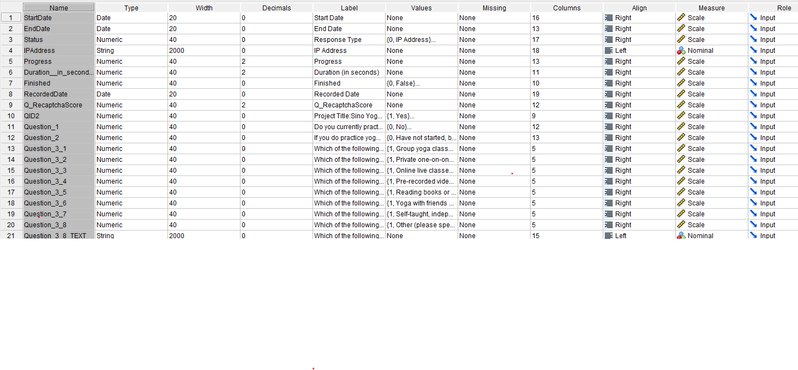

### Data Initial Cleaning

1.  We started by removing the meta data we did not need such as variables named **StartDate, EndDate, Status, Progress, Duration_in_seconds\_, Finished, Q_RecaptchaScore,** and **QID2**. After clearing that off the file we got 74 observations and 63 variables.

2.  We checked for duplicate responses using the **IPAddress** data**,** we created a variable named **PrimaryLast** through the Data\> Identify duplicate cases, using the **IPAddress** as the identifier. This showed 1 repeating **IPAddress** response Using Data\>Select Cases\>If condition is satisfied, we created a filter **PrimaryLast=1**. Using this case, we kept the last response the respondent made before we closed the survey count.

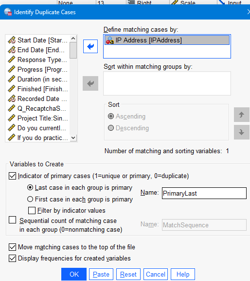{fig-align="center" width="270"}

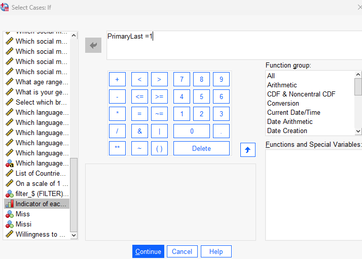{fig-align="center" width="270"}

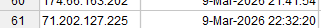

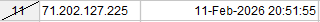

3.  We checked to make sure the data we were analyzing was between the collected time frame period of February 10,2026 to June 9, 2026. The IRB approval created 2 responses we did not need to analyze before our survey launch date. We used Data\>Select Cases and made a filter to add to remove that data from being used.

    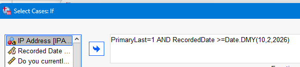{width="354"}

    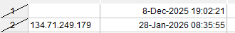

4.  We checked for Missing data using (Analyze\>Descriptive\>Frequencies) selecting all questions and see how many were unanswered for each question. We then used (Transform\>count values within cases) created a new (Target Variable: **Missi)** and inputted all question variables and in (Define Values) we put (System-Missing). Using this new variable we updated the select cases condition to Missi\<43 since with multiple choice questions the overall available answers were 45 questions. This indicated if someone answered less than 2 questions to remove the respondent from our data.

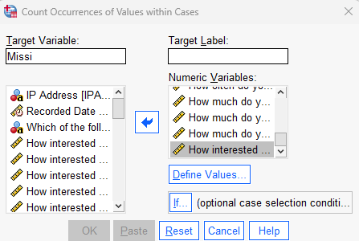{fig-align="center" width="245"}

{fig-align="center" width="495"}

5.  Lastly on SPSS we made sure Willingness to Pay was in correct values as a numeric dollar amount to calculate the mean for predictive analysis. creating a Willingness to Pay(WTP_DOLLARS) variable using (Transform\> re code into different values) we made 1= 2.99, 2=3.99, 3=4.99, 4=5.99, and 5-sys_missing. Using this new variable we were able to find the mean of the willingness to pay not including the other:text input as \~4.33, for us to determine that 4.99 was the best value for the mean of willingness to pay.

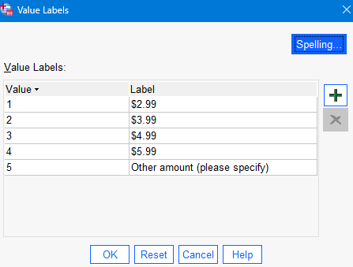{fig-align="center" width="233"}

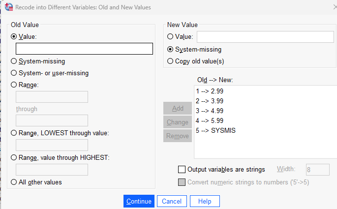{fig-align="center" width="335"}

6.  We saved this new dataset as **msdm_cleandata.csv** to use in Rstudio to clean, transform, wrangle , and visualize in predictive analysis.

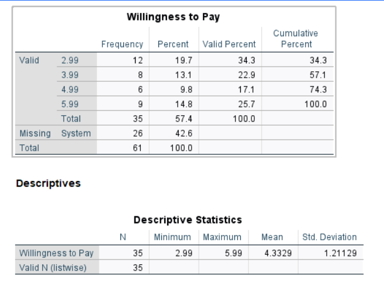{fig-align="center" width="496"}

# SPSS Descriptive Analysis

Thirty-five respondents selected one of the predefined price options, while 26 respondents provided open-ended responses. Because the open-ended responses were non-numeric and not directly comparable to the fixed pricing categories, they were excluded from the quantitative analysis.

Although \$2.99 was the most frequently selected price point (34.3%), the mean willingness to pay was \$4.33, indicating that respondents were, on average, willing to pay more than the lowest pricing tier. Since the average respondent is willing to pay \$4.33, choosing **\$4.99** places the price close to the center of respondents' willingness to pay while increasing revenue per subscriber. About 42.8% of respondents selected either \$4.99 or \$5.99 suggesting that nearly half of the respondents were comfortable paying a premium membership price.\

# R Predictive Analysis

## Data Wrangling

Creating a new project in Rstudio called MSDM we attached a Github repository to work as a team in predictive analysis.

### Load Libraries

```{r}
#| message: false
#| warning: false
# Load libraries
library(haven)
library(tidyverse)
library(dplyr)
library(janitor)
library(lubridate)
```

## Read CSV

Using read.csv() we opened the new downloaded msdm_cleandata.csv that has 61 observations and 53 variables, in a dataset called **msdm_data**, and viewing only the top 3 observations of the data.

```{r}
msdm_data <- read.csv("msdm_cleandata.csv")
head(msdm_data,3)
#view(msdm_data)
#str(msdm_data)
```

## Clean_name and Date

We cleaned the dataset **msdm_data** by upper_camel the varaiable names and also removing any spaces and special characters. Afterwards we renamed that dataset as **SurveyData** to keep separate. We changed the **RecordedDate** variable to Date format and checked to make sure it was changed.

```{r}
#Clean Variable Names
SurveyData <- clean_names(msdm_data) |>  #clean SurveyData names
              clean_names(case= "upper_camel") #clean up using upper_camel

#head(SurveyData) #check to see changes made to SurveyData

#change startdate to Date
SurveyData$RecordedDate <- as.Date(SurveyData$RecordedDate,
  format = "%m/%d/%Y %H:%M:%S")

str(SurveyData$RecordedDate)
#head(SurveyData)
```

## Survey Variables

We cleaned the survey variable names for the questions to be easier to identify using rename(). Then those renamed variables were included in the new dataset named **CleanSurveyData.**

```{r}
#| message: false
#| warning: false
#change variable names
CleanSurveyData <- SurveyData |>
  rename(
    PracticeYogaInterest = Question1,
    YogaExperience = Question2,
    YogaActivityGroup= Question3_1,
    YogaActivityPrivate= Question3_2,
    YogaActivityOnline= Question3_3,
    YogaActivityPreRec= Question3_4,
    YogaActivityBook= Question3_5,
    YogaActivityFriend= Question3_6,
    YogaActivitySelfTaught= Question3_7,
    YogaActivityOther= Question3_8,
    YogaActivitiesOtherText = Question3_8Text,
    YogaFrequency = Question4,
    YogaContent = Question5_1,
    YogaLifestyle = Question5_2,
    YogaInfoSeeking = Question5_3,
    PrefVideoShorts = Question6_1,
    PrefVideoShortVideo = Question6_2,
    PrefVideoMedium = Question6_3,
    PrefVideoFulllength = Question6_4,
    BegFlowInterest = Question7_1,
    StressReliefInterest = Question7_2,
    TradChineseInterest = Question7_3,
    BreathworkInterest = Question7_4,
    FullLengthInterest = Question7_5,
    MonthProgramInterest = Question7_6,
    ShortDailyInterest = Question7_7,
    MemberInterest = Question8,
    WillingnessToPay = Question9,
    WillingnessToPayText = Question9_5Text,
    VisitLikelihood = Question10,
    YoutubeSocial = Question11_1,
    InstagramSocial = Question11_2,
    TIkTokSocial = Question11_3,
    FacebookSocial= Question11_4,
    PinterestSocial = Question11_5,
    AgeGroup = Question12,
    Gender = Question13,
    IncomeBracket = Question14,
    EnglishLang = Question15_1,
    MandarinLang = Question15_2,
    CantoneseLang = Question15_3,
    SpanishLang= Question15_4,
    OtherLang = Question15_5,
    OtherLangeText = Question15_5Text,
    Country = Question16,
    SearchInterest = Question17
  )

head(CleanSurveyData,3)
```

## Clean Data Part 2

We re coded any variables that were not re coded in SPSS such as **MemberInterest, Country,** and **Gender.** Lastly we joined the variable **WillingnessToPayText** with **WtpDollars** using coalesce, only after changing the **WillingnessToPayText** to numeric variables and anything not able to be changed to numeric to be NA. We kept the joined variables into WtpDollars and just renamed the dataset CleanSurveyDataJoin. This became the final transforming and cleaning of the dataset before the predictive analysis.

```{r}
#| message: false
#| warning: false
#Clean Data
#recode any values not recoded on SPSS and Qualtrics
CleanSurveyData$MemberInterest <-
  recode(
    CleanSurveyData$MemberInterest,
    `27` = 1,
    `28` = 2,
    `29` = 3
  )

#Clean country to categorical
CleanSurveyData$Country <-
  factor(
    CleanSurveyData$Country,
    levels = c(31,185,187),
    labels = c("China","Taiwan","United States")
  )

#clean gender 
CleanSurveyData$Gender <- as.factor(CleanSurveyData$Gender)


#join text and regular wtp
CleanSurveyDataJoin<- CleanSurveyData |>
  mutate(
    WillingnessToPayText= as.numeric(WillingnessToPayText),
    WtpDollars= coalesce(WtpDollars, WillingnessToPayText)
  )

head(CleanSurveyDataJoin$WtpDollars,10)
```

## Plot Willingness to Pay

```{r}
library(ggplot2)
library(ggthemes)

mean_wtp <- mean(CleanSurveyData$WtpDollars, na.rm = TRUE)

ggplot(CleanSurveyData, aes(WtpDollars)) +
  geom_histogram(
    binwidth = 0.5,
    fill = "#2563EB",
    color = "white",
    linewidth = 0.7
  ) +
  geom_vline(
    xintercept = mean_wtp,
    color = "#EF4444",
    linewidth = 1.5,
    linetype = "dashed"
  ) +
  annotate(
    "label",
    x = mean_wtp + .05,
    y = 11,
    label = paste0("Mean: $", round(mean_wtp,2)),
    fill = "#EF4444",
    color = "white",
    fontface = "bold",
    label.size = 0
  ) +
  scale_x_continuous(
    breaks = c(2.99,3.99,4.99,5.99),
    labels = c("$2.99","$3.99","$4.99","$5.99")
  ) +
  labs(
    title = "Distribution of Monthly Willingness to Pay",
    subtitle = "Sino Yoga Survey (n = 35)",
    x = "Membership Price",
    y = "Respondents"
  ) +
  theme_few(base_size = 15) +
  theme(
    plot.title = element_text(face = "bold", size = 22),
    plot.subtitle = element_text(color = "grey40"),
    axis.title = element_text(face = "bold"),
    panel.grid.minor = element_blank(),
    legend.position = "none"
  )
```

```{r}
stats <- data.frame(
  Measure = c("Mean", "Median"),
  Value = c(
    mean(CleanSurveyData$WtpDollars, na.rm = TRUE),
    median(CleanSurveyData$WtpDollars, na.rm = TRUE)
  )
)

ggplot(stats, aes(x = Measure, y = Value, fill = Measure)) +
  geom_col(width = 0.55, show.legend = FALSE) +
  geom_text(
    aes(label = paste0("$", sprintf("%.2f", Value))),
    vjust = -0.5,
    size = 5,
    fontface = "bold",
    color = "black"
  ) +
  scale_fill_manual(values = c("#2D7FF9", "#6CC3D5")) +
  scale_y_continuous(
    limits = c(0, 6),
    breaks = seq(0, 6, 1),
    expand = expansion(mult = c(0, 0.05))
  ) +
  labs(
    title = "Monthly Willingness to Pay",
    subtitle = "Comparison of Mean and Median Membership Price",
    x = NULL,
    y = "Monthly Price (USD)"
  ) +
  theme_minimal(base_size = 15) +
  theme(
    plot.title = element_text(face = "bold", size = 20, hjust = 0.5),
    plot.subtitle = element_text(size = 13, color = "gray40", hjust = 0.5),
    axis.title.y = element_text(face = "bold"),
    axis.text = element_text(size = 13),
    panel.grid.major.x = element_blank(),
    panel.grid.minor = element_blank(),
    panel.grid.major.y = element_line(color = "#E6E6E6"),
    plot.background = element_rect(fill = "white", color = NA)
  )
```

## Cluttered Correlation Matrix

We created a correlation matrix to see what variables were positively and negatively impacting **WtpDollars (willingness to pay).** This correlation was extremely cluttered so we focused on variables that seemed to correlate with **WtpDollars.**

```{r}
#| message: false
#| warning: false
library(corrplot)
#PairWise Correlation of Continuous Variables
#new Data Set to keep everything numeric
str(CleanSurveyData)
DataForCorAnalysisAll = CleanSurveyDataJoin |>
                       select(where(is.numeric))
CorMatrixAll = cor(DataForCorAnalysisAll, use= "pairwise.complete.obs")

corrplot(CorMatrixAll, method = 'shade', addCoef.col = 'black', type = 'full', number.cex = 0.6, order = 'original', diag= FALSE)
```

## Correlation Matrix Cleaned

We used variables such as Y**ogaExperience, WillingnessToPay, SearchInterest, YogaContent, MandarinLang, VisitLikelihood,WtpDollars, MemberInterest, YogaFrequency,** and **PrefVideoShorts** in this correlation matrix.

### Correlation Matrix Analysis

1.  

```{r}
#Narrow Down Correlation Matrix
DataForCorAnalysis = CleanSurveyDataJoin |>
                     select(YogaExperience, WillingnessToPay,SearchInterest,YogaContent,MandarinLang, VisitLikelihood, WtpDollars,MemberInterest, YogaFrequency, PrefVideoShorts)

CorMatrix = cor(DataForCorAnalysis, use= "pairwise.complete.obs")
corrplot(CorMatrix, method = 'shade', addCoef.col = 'black', type = 'full', number.cex = 0.6, order = 'original', diag= FALSE)
```

## Linear Regressions

### Linear Regression 1

```{r}
#| message: false
#| warning: false
#Linear Regression
set.seed(123)
#library(tidymodels)
library(rio)

ModelSurvey= lm(WtpDollars ~ YogaFrequency, CleanSurveyDataJoin)

summary(ModelSurvey)


```

::: callout-tip
Interpretation

-   R-squared 0.10 #Adjusted r-squared 0.08

-   Overall model is significant (p= 0.030 \< 0.05)

-   YogaFrequency = 0.882 (p = 0.030)

-   If everything else stays the same, a 1 point increase in yoga frequency increases willingness to pay by about \$0.88

-   People who practice yoga more frequently are willing to pay more

-   Focus on encouraging consistent yoga practice through series, challenges and weekly classes

------------------------------------------------------------------------

**Impact:** Yoga frequency nudges willingness to pay (\~\$0.88 per point) but explains only \~10% of it on its own, so it supports engagement tactics rather than serving as a basis for pricing\
:::

### Linear Regression 2

```{r}
#| message: false
#| warning: false
set.seed(123)
ModelSurvey2= lm(WtpDollars ~ VisitLikelihood, CleanSurveyDataJoin)

summary(ModelSurvey2)
```

::: callout-tip
Interpretation

-   R-squared = 0.145

-   Adjusted R-squared = 0.126

-   Overall model is significant (p = 0.008 \< 0.05)

-   VisitLikelihood = 1.187 (p = 0.008) #If everything else stays the same, a 1 point increase in visit likelihood increases willingness to pay by about \$1.19

-   People who are more likely to visit Sino Yoga are willing to pay more

-   Focus on driving website visits through YouTube CTAs, email, and community engagement

------------------------------------------------------------------------

**Impact:** Visit likelihood is the higher-leverage driver — \$1.19 per point versus \$0.88 for frequency — so moving viewers to the website returns more per point than getting them to practice more
:::

### Linear Regression 3

```{r}
#| message: false
#| warning: false
set.seed(123)
ModelSurvey3= lm(WtpDollars ~ VisitLikelihood+YogaFrequency, CleanSurveyDataJoin)

summary(ModelSurvey3)
```

::: callout-tip
Interpretation

-   R-squared = 0.189

-   Adjusted R-squared = 0.152

-   Overall model is significant (p = 0.010 \< 0.05)

-   VisitLikelihood remains significant

-   YogaFrequency is no longer significant after controlling for visit likelihood

-   People who are more engaged with Sino Yoga are willing to pay more than those who simply practice yoga frequently

-   Focus on increasing engagement with the Sino Yoga brand and moving viewers toward memberships

------------------------------------------------------------------------

**Impact:** With both predictors in the model, engagement absorbs the effect and frequency drops out — the revenue lever is brand engagement, not practice volume, so spend should go toward converting engaged viewers rather than encouraging more practice
:::

### Linear Regression 4

```{r}
#| message: false
#| warning: false
set.seed(123)
ModelSurvey4= lm(WtpDollars ~ AgeGroup+Gender+YogaFrequency+MandarinLang, CleanSurveyDataJoin)

summary(ModelSurvey4)
```

::: callout-tip
Interpretation

-   R-squared = 0.236

-   Adjusted R-squared = 0.161

-   Overall model is significant (p = 0.024 \< 0.05)

-   AgeGroup = -1.853 (p = 0.018)

-   YogaFrequency = 1.054 (p = 0.012)

-   MandarinLang is marginally significant (p = 0.085)

-   Younger respondents and more frequent yoga practitioners are willing to pay more

-   Continue bilingual content and encourage regular yoga practice

------------------------------------------------------------------------

**Impact:** Age and practice frequency together explain more of willingness to pay than either alone, so the highest-value segment to target is younger, frequent practitioners — with bilingual content as a secondary lift
:::

### Linear Regression 5

```{r}
#| message: false
#| warning: false
set.seed(123)
ModelSurvey5= lm(WtpDollars ~ AgeGroup+Gender+YogaFrequency+MandarinLang+Country, CleanSurveyDataJoin)

summary(ModelSurvey5)
```

::: callout-tip
Interpretation

-   R-squared = 0.329

-   Adjusted R-squared = 0.203

-   Overall model is significant (p = 0.035 \< 0.05)

-   MandarinLang = 2.086 (p = 0.010)

-   Country is not significant

-   Mandarin-speaking respondents are willing to pay about \$2.09 more than non-Mandarin speakers Language matters more than country

-   Continue investing in bilingual English and Traditional Chinese content

------------------------------------------------------------------------

**Impact:** Language, not country, is what moves willingness to pay — Mandarin speakers pay about \$2.09 more, so investment in bilingual (English + Traditional Chinese) content targets the difference directly, where geographic targeting would not
:::

### Linear Regression 6

```{r}
#| message: false
#| warning: false
set.seed(123)
ModelSurvey6= lm(WtpDollars ~ AgeGroup+Gender+YogaFrequency+MandarinLang+PracticeYogaInterest, CleanSurveyDataJoin)

summary(ModelSurvey6)
```

::: callout-tip
Interpretation

-   R-squared = 0.246

-   Adjusted R-squared = 0.151

-   Overall model is significant (p = 0.039 \< 0.05)

-   AgeGroup = -1.847 (p = 0.019) #YogaFrequency = 1.152 (p = 0.010)

-   PracticeYogaInterest is not significant (p = 0.468)

-   Simply being interested in yoga does not increase willingness to pay

-   People who actually practice yoga more frequently are willing to pay more

-   Focus on building consistent practice habits instead of only generating interest

------------------------------------------------------------------------

**Impact:** Stated interest adds nothing to willingness to pay once behavior is accounted for, so marketing spend aimed at generating interest is unlikely to raise revenue — converting interest into actual practice is what pays off
:::

### Linear Regression 7

```{r}
#| message: false
#| warning: false
set.seed(123)
ModelSurvey6= lm(WtpDollars ~ AgeGroup+Gender+YogaFrequency+MandarinLang+PracticeYogaInterest+YoutubeSocial, CleanSurveyDataJoin)

summary(ModelSurvey6)
```

::: callout-tip
Interpretation

-   R-squared = 0.257

-   Adjusted R-squared = 0.133

-   Overall model is NOT significant (p = 0.081 \> 0.05)

-   YoutubeSocial is not significant (p = 0.544)

-   AgeGroup and YogaFrequency remain significant

-   Finding Sino Yoga through YouTube/social media alone does not increase willingness to pay

-   Focus on retaining viewers and converting them into active community members rather than only acquiring new viewers

------------------------------------------------------------------------

**Impact:** Adding the YouTube/social discovery variable makes the whole model non-significant and contributes nothing itself, so acquisition channel does not predict willingness to pay — budget is better spent retaining and converting existing viewers than on reaching new ones
:::

## Random Forest (Failed)

```{r}
#Random Forest Predictor Failed because of Sample Size
#remove NA respondents
set.seed(123)
library(randomForest)

model_data <- CleanSurveyDataJoin|> #new data to use for predicitive analysis
                 select(WtpDollars,YogaFrequency,AgeGroup,Gender, VisitLikelihood, YogaExperience,PracticeYogaInterest, MemberInterest) |> #select 
                 na.omit()


rf <- randomForest(
  WtpDollars ~ .,
  data = model_data,
  importance = TRUE
)

varImpPlot(rf)
print(rf)
```

## Decision Tree

```{r}
#| message: false
#| warning: false
library(rpart)
library(rpart.plot)
set.seed(123)

model_data2 <- CleanSurveyDataJoin|> #new data to use for predicitive analysis
                 select(WtpDollars,YogaFrequency,VisitLikelihood, YogaExperience,PracticeYogaInterest, MemberInterest, AgeGroup, Gender, Country) |> 
                 na.omit()

 dt <- rpart( #decison tree 
  WtpDollars ~ .,
  data = model_data2,
  method = "class")
  
  rpart.plot(
  dt,
  type = 2,
  extra = 104,
  fallen.leaves = TRUE,
  box.palette = "Greens"
)
summary(dt)
```

The decision tree shows a that at the root predicted WillingnesstoPay to be 2.99 with 100% of of respondents. The numbers underneath mean that \$0 represents 23%, \$2.99 represents 30%, \$3.99 represents 10%, \$4.99 represents 20%, and \$5.99 represents17% of all respondents. The first split shows that Yoga Frequency being less than 5 was the most important predictor. The first thing that separates willingness to pay is how frequently someone practices yoga.

The left branch shows that if there are less frequent yoga practitioners than 5 the tree predicts them answering \$2.99, but if MemberInterest is less than 3 the predicted willingness to pay is \$0. People who practice yoga less frequently and have low membership interest predict to pay \$0. These respondents are unlikely to purchase a membership. If MemberInterest is greater than 3 then the prediction changes to \$4.99 at 30%. Even if someone doesn't practice yoga very frequently high membership interest increases predicted willingness to pay.

The right branch shows YogaFrequency\>=5 these respondents are predicted to pay \$3.99 representing 27% of respondents. Frequent yoga practitioners are predicted to pay around \$3.99 regardless of membership interest in this tree.

The Decision Tree suggest that Yoga Frequency is the most important predictor and frequent practitioners are willing to pay more for a membership. Engagement level is the strongest determinant of willingness to pay. Membership interest further separated those unwilling to pay from those willing ot pay, less frequent practitioners, membership interest separates those who would pay nothing form those wiling to pay \~\$4.99.

## Cluster Analysis 1

```{r}
library(factoextra)
set.seed(123)

model_data3 <- CleanSurveyDataJoin|> #new data to use for predicitive analysis
                 select(WtpDollars,YogaFrequency, VisitLikelihood, YogaExperience,PracticeYogaInterest, MemberInterest) |> 
                 na.omit() #omit NA values

cluster_scaled <- scale(model_data3)

fviz_nbclust(
  cluster_scaled,
  kmeans,
  method = "wss"
)

##Cluster at 3 
k3 <- kmeans(
  cluster_scaled,
  centers = 3,
  nstart = 25
)


model_data3$Cluster <- factor(k3$cluster)

fviz_cluster(
  k3,
  data = cluster_scaled,
  ellipse.type = "convex"
)
```

### Elbow Plot

Noticeable bend around K=3, or K=4

### Cluster Plot

Cluster shows respondents naturally separate into 3 groups.

1.  Cluster (Red): Right side

2.  Cluster (Green): Small group between 2 clusters

3.  Cluster (Blue): Left side

```{r}
model_data3 %>%
  mutate(Cluster = factor(k3$cluster)) %>%
  group_by(Cluster) %>%
  summarise(across(everything(), mean))
```

### Cluster 1: Low Membership Potential

#### Characteristics:

1.  Lowest willingness to pay\~\$2.31

2.  Lowest membership interest \~1.44

3.  Lowest likelihood of visiting the website \~2.63

4.  Highest yoga experience among the clusters \~2.76

#### Marketing Strategy:

These respondents appear experience yoga practitioners but are not very interested in a Sino Yoga membership. Focus on increase value of membership, explaining membership benefits, free educational content before promoting subscriptions

### Cluster2: High Yoga Frequency but Price Sensitive

#### Characteristics:

1.  Practice yoga more frequently \~4.5

2.  Moderate willingness to pay \~2.99

3.  Moderate membership interest \~2

4.  Lower yoga experience \~2.06

#### Marketing Strategy:

These respondents appear active but not convinced of the membership value. Focus on trial memberships, beginner friendly member content, and YouTube live reminders.

### Cluster3: High Value Audience

#### Characteristics:

1.  Highest willingness to pay\~\$5.29

2.  Highest membership interest\~2.76

3.  Highest website visit likelihood \~2.63

4.  Regular yoga practitioners \~3.76

#### Marketing Strategy:

These respondents appear to be the ideal market customers. Focus on membership promotions, premium content, exclusive classes, community benefits, direct call to actions from YouTube to website.

```{r}
table(k3$cluster)

```

## Cluster Analysis 2

Performing cluster analysis again as K=2 cluster because it makes it more reliable and easier to interpret.

```{r}
library(factoextra)
set.seed(123)

model_data3 <- CleanSurveyDataJoin|> #new data to use for predicitive analysis
                 select(WtpDollars,YogaFrequency, VisitLikelihood, YogaExperience,PracticeYogaInterest, MemberInterest) |> 
                 na.omit() #omit NA values

cluster_scaled <- scale(model_data3)

fviz_nbclust(
  cluster_scaled,
  kmeans,
  method = "wss"
)

##Cluster at 2 
k2 <- kmeans(
  cluster_scaled,
  centers = 2,
  nstart = 25
)


model_data3$Cluster <- factor(k2$cluster)

fviz_cluster(
  k2,
  data = cluster_scaled,
  ellipse.type = "convex"
)
```

```{r}
model_data3 %>%
  mutate(Cluster = factor(k2$cluster)) %>%
  group_by(Cluster) %>%
  summarise(across(everything(), mean))
```

```{r}
table(k2$cluster)
```

### Cluster 1: Price Conscious Audience

#### Characteristics:

1.  Lowest willingness to pay\~\$2.35

2.  Lowest membership interest \~1.41

3.  Lowest likelihood of visiting the website \~2.65

4.  Highest yoga experience among the clusters \~2.67

#### Marketing Strategy:

These respondents appears to be interested in yoga but not convinced of the value of a membership. Focus on providing relevant free YouTube content, emphasize value of membership through testimonials, exclusive content. Use email and YouTube shorts to increase engagement before asking for membership purchases.

### Cluster2: High Value Membership Prospects

#### Characteristics:

1.  Highest willingness to pay\~\$5.16

2.  Highest membership interest\~2.78

3.  Highest website visit likelihood \~3.83

4.  Regular yoga practitioners \~2.11

#### Marketing Strategy:

These respondents appears to be Sino Yoga's highest converting audience. Focus on promoting memberships, highlighting premium member benefits, direct viewers to website with strong call to actions, offer exclusive live classes and community access.

## Cluster Analysis Importance

The strongest distinction between the clusters in engagement with the brand, not yoga behavior alone. Respondents who are more interested in Sino Yoga memberships are more likely to visit the website and also willing to pay more. Increasing user engagement with Sino Yoga is likely to have a greater impact on membership conversion than targeting demographic characteristics.
